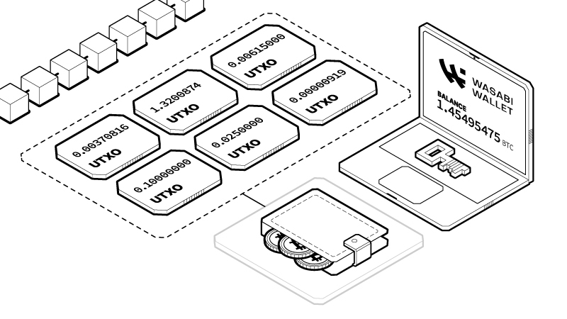

# Overview

## About CoinJoin with Wasabi Wallet

Wasabi's CoinJoin implementation is open-source and Bitcoin-only on desktop. The wallet itself is privacy-focused, and offers some of the highest security standards. It is easy to use, but has a small learning curve. It is fully non-custodial and access to funds can never be restricted. It has a large community of users and the development team is transparent and reputable.&#x20;

### **Automatic Coinjoin**
Wasabi takes care of your financial privacy by automatically starting to coinjoin all your funds for a fixed 0.3% coordination fee plus the Bitcoin network fees. Coins of 0.01 BTC or below don't pay coordination fees. Remixes, even after one transaction, also don't pay coordination fees. Thus, a payment made with coinjoined funds allows the sender and the recipient to remix their coins without paying any coordination fees.
The coinjoin strategy can be customized to each user's needs by optimizing for speed, costs, or privacy. The automatic coinjoin feature is enable by default, but the user can disable it at anytime.

### **Automatic Coin Selection**

Sending bitcoin with Wasabi wallet is simpler than ever. Just enter the address you want to send bitcoin to, then enter the amount of bitcoin or the dollar value you would like to send. Once you add the recipient labels, the wallet will automatically select the best private coin combinations for this transaction.

These coins are also known as Unspent Transaction Outputs (UTXO). Think of bitcoins as actual physical coins of different amounts in your pocket. When you spend them, you will combine the coins and then get some new change returned to your wallet if you didn't have the exact amount. Avoiding change has the benefit of creating a smaller digital footprint on the blockchain as well as making your transactions more private. Wasabi Wallet will remind you of this during the Transaction Preview before sending the coins.

### Labeling

For every bitcoin transaction you send and receive, it is important to identify who is observing that transaction. The label serves the purpose of making sure that we are aware of who is sending us coins and who we are sending them to. Bitcoin transactions being public, we want to avoid as much as possible revealing our transaction history to anyone that might be keeping track of us.

So for example, if you receive bitcoin from Bull Bitcoin as payment for a job you completed, you should add the label “Bull Bitcoin” to that coin. Then if you want to send some bitcoin to Alice, you can use the same coin by adding the label "Alice". The change coin would then have two labels, "Alice" and "Bull Bitcoin", since those are the two entities that know this change coin belongs to you. If you wish to sell the coin on the Bull Bitcoin platform, just add the label “Bull Bitcoin” as the recipient when sending.
